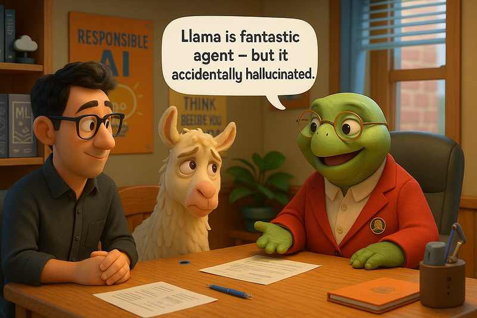

# bug-free-octo-pancake
Redteaming LLM applications with Giskard. This GitHub repository is a companion resource to the Medium article [Think Your RAG App Is Safe? Giskard Might Prove You Wrong](https://google.com/)

<p align="center">
    
</p>

## Setup
This repository uses the [uv package installer](https://docs.astral.sh/uv/pip/packages/). 

To create a virtual environment with the dependencies installed, simply type in your terminal:
```
uv sync
```